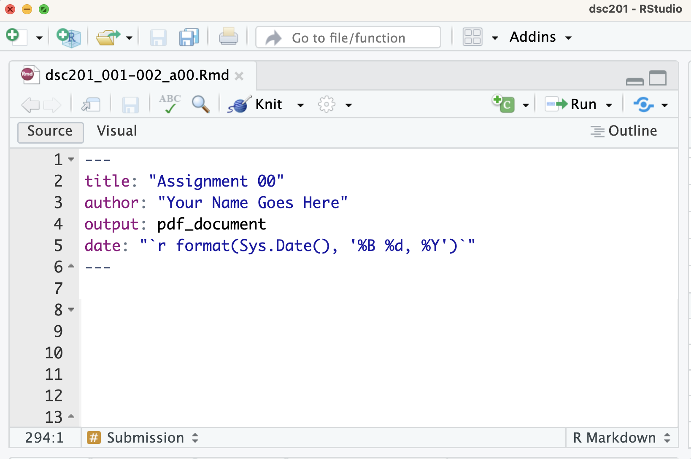
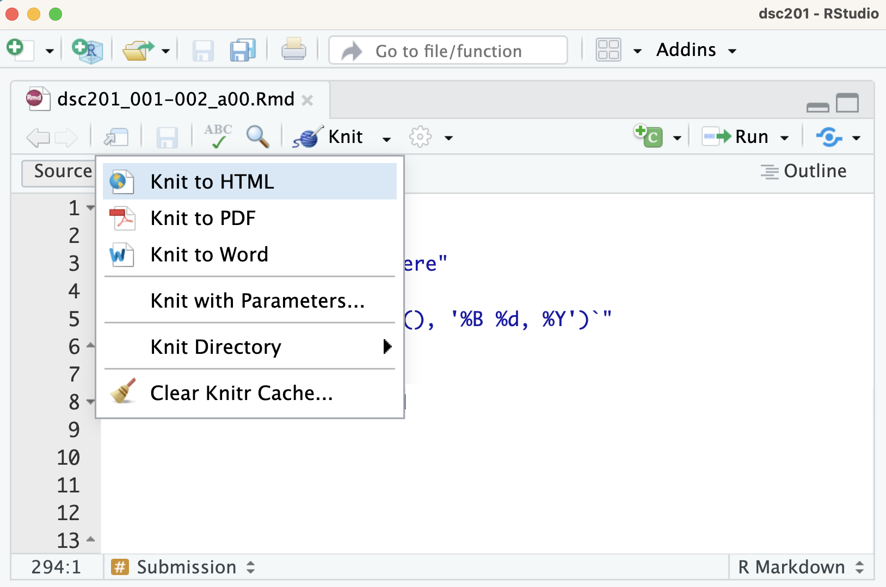

## Knitting Assignment 00

In RStudio, **knitting** is the process of taking a source document written in R Markdown (`.Rmd`) and combining the text, code, and code output into a single rendered file, such as HTML, PDF, or Word. When a document is knitted, RStudio runs all code chunks, captures their output (e.g., tables, plots, and summaries), and integrates the results with the written text.

## Knitting to PDF

### Using the YAML Header

To knit directly to PDF by default, specify PDF output in the YAML header at the top of your document.

::: text-center
{width="75%"}
:::

### Using the Knit Menu

To manually knit a document to PDF:

1.  Click the **Knit** button in RStudio.
2.  Select **Knit to PDF** from the drop-down menu.

::: text-center
{width="75%"}
:::

## Common Knitting Errors

### Missing `knitr`

If you see the following message when attempting to knit

> Required package 'knitr' is missing. Would you like to install it?

the `knitr` package has not yet been installed on your computer.

Click **Yes** and RStudio will automatically install `knitr` and any required dependencies. Once installation is complete, knitting should begin again automatically.

If the document knits successfully, no further action is required.

### Missing LaTeX

If you instead see an error similar to the one below:

::: callout-warning
Error: LaTeX failed to compile RMarkdown.tex. See https://yihui.org/tinytex/r/#debugging for debugging tips. In addition: Warning message: In system2(..., stdout = if (use_file_stdout()) f1 else FALSE, stderr = f2) : '"pdflatex"' not found

Execution halted No LaTeX installation detected (LaTeX is required to create PDF output). You should install a LaTeX distribution for your platform: https://www.latex-project.org/get/
:::

your computer does not have a LaTeX distribution installed. To create PDF files from R Markdown, you must install a LaTeX distribution such as TinyTeX.

Proceed to the instructions below.

## Installing TinyTeX for PDF Output

To knit R Markdown documents to PDF, your computer needs a LaTeX installation. We recommend TinyTeX because it is lightweight, easy to install, and integrates well with RStudio.

### TinyTeX vs. `tinytex`

#### TinyTeX

TinyTeX is a lightweight LaTeX distribution used to compile R Markdown documents into PDF files. It performs the actual PDF creation process.

#### `tinytex`

`tinytex` is an R package that installs and manages TinyTeX from within RStudio.

## Steps to Set Up TinyTeX

### Step 1: Install the `tinytex` Package

- Open RStudio.
- In the **Console**, run:

``` r
install.packages("tinytex")
```

**Note:** This installs the `tinytex` package, which manages the TinyTeX installation.

### Step 2: Install TinyTeX

- In the **Console**, run:

``` r
tinytex::install_tinytex()
```

**Note:** This command downloads and installs TinyTeX on your computer and may take several minutes.

### Step 3: Verify the Installation

- In the **Console**, run:

``` r
tinytex::tinytex_root()
```

If the command returns a file path, TinyTeX has been installed successfully.

Example paths:

- macOS/Linux: `"/usr/local/texlive/..."`
- Windows: `"C:\\Users\\YourName\\AppData\\Roaming\\TinyTeX\\..."`

### Step 4: Knit to PDF

- Open your `.Rmd` file in RStudio.
- Verify that the YAML header specifies PDF output:

``` yaml
---
title: "Your Title"
author: "Your Name"
output: pdf_document
---
```

- Click **Knit**.
- Select **Knit to PDF** if prompted.

RStudio will now use TinyTeX to generate a PDF version of your document.
