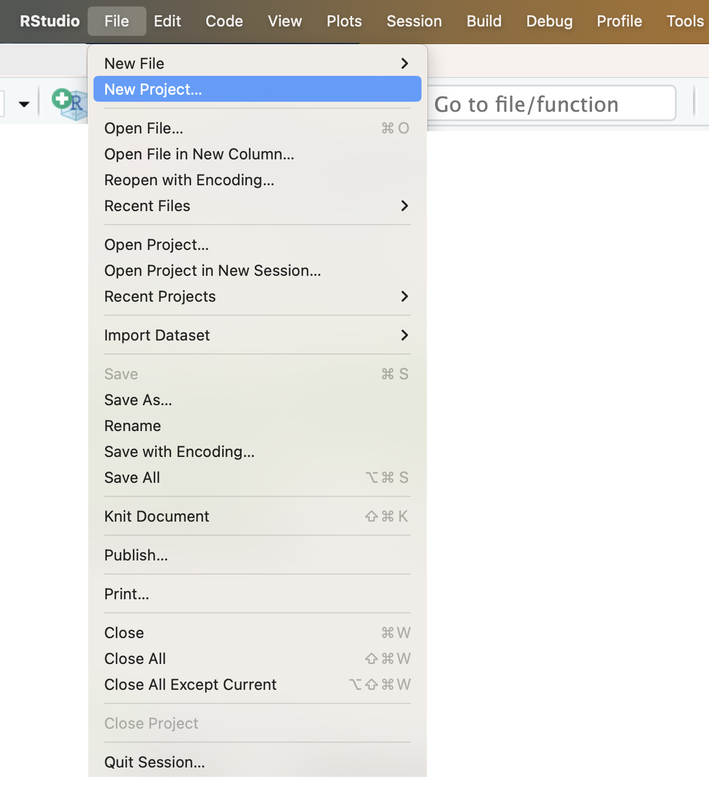
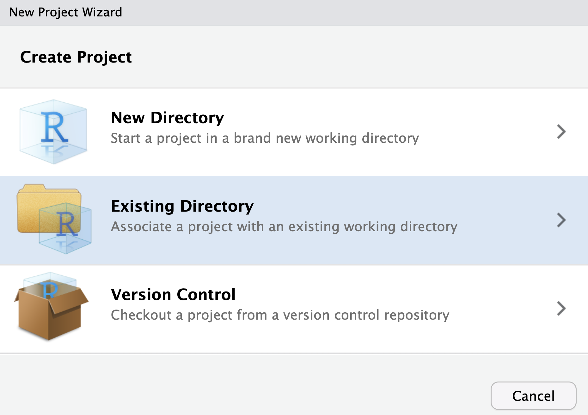
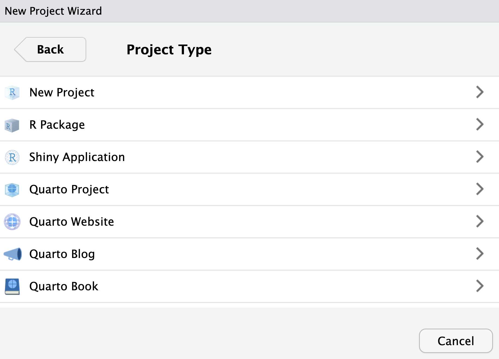
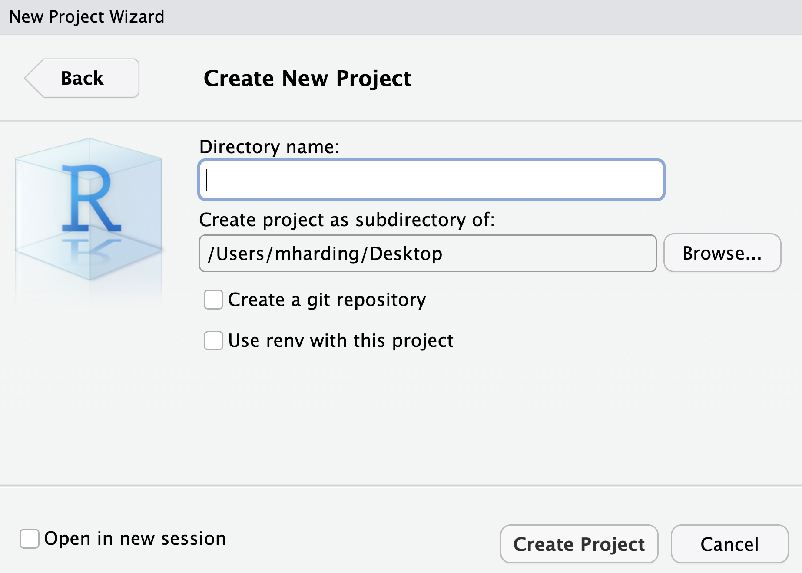
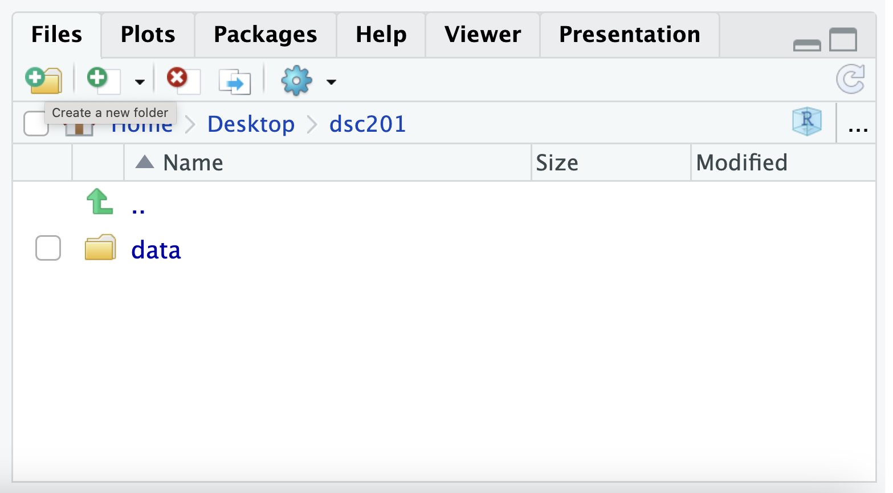
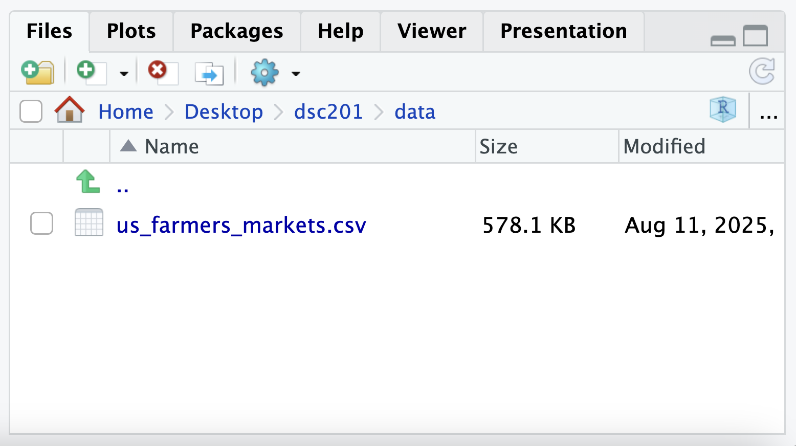
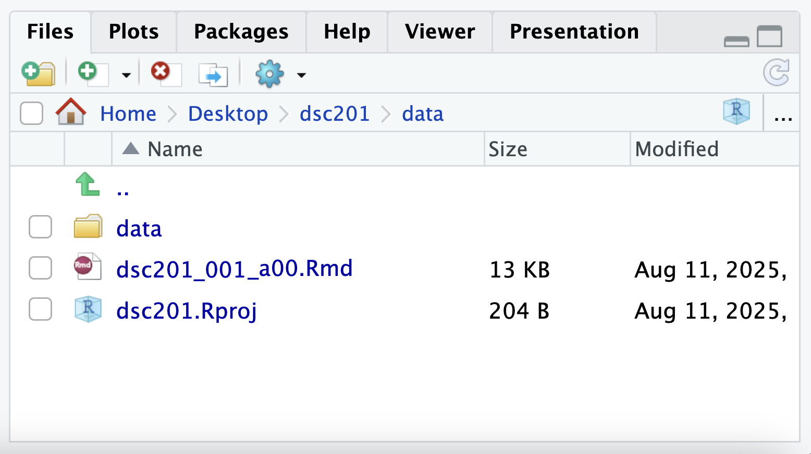

## Setting up Your RProject Folder

Follow these steps to:

- Create an Rproject folder named `dsc201`.
- Create a data folder inside the RProject folder.
- Download a dataset the `us_farmers_markets.csv` into the data folder.
- Download the `ds201_001-002_a00.Rmd` RMarkdown file into the RProject folder.

**Note:** Following these steps helps avoid file path errors and follows best practices from [Martin Chan’s RStudio Projects and Working Directories: A Beginner’s Guide](https://martinctc.github.io/blog/rstudio-projects-and-working-directories-a-beginner%27s-guide/).

### Step 1: Create a new RStudio project

1.  Open RStudio.

2.  Go to **File → New Project…**

::: text-center
{width="75%" height="75%"}
:::

3.  Select **New Directory → New Project**.

::: text-center
{width="75%" height="75%"}
:::

4.  **Select New Project**.

::: text-center
{width="75%" height="75%"}
:::

5.  In **Directory name:**, enter dsc201 (all lowercase)
6.  In Create project as subdirectory of:, select Browse, then choose a location on your computer (e.g., Documents, Desktop, etc).

::: text-center
{width="75%" height="75%"}
:::

7.  Click **Create Project**.

**Note:** Opening the `dsc201.Rproj` file will automatically set your working directory to the project’s root folder.

### Step 2: Create the data folder

**Important:** Name the folder `data` **(all lowercase)**.

8.  In RStudio’s **Files** pane (bottom right), click the **New Folder** icon.

::: text-center
{width="75%" height="75%"}
:::

9.  In **Please enter the new folder name**, enter data.

10. Click **OK**.

**Important:** Name the folder `data` **(all lowercase)**. Using all lowercase avoids issues on operating systems where `Data` and `data` are treated as different folders.

### Step 3: Download the `us_farmers_markets.csv` data file

11. Download the `us_farmers_markets.csv` dataset from the course Moodle page.

12. Locate it in your browser’s **Downloads** folder then move it manually into your `dsc201/data` RProject folder.

13. Confirm the file is in the right place by checking in RStudio’s **Files** pane. You should see it in `data/us_farmers_markets.csv`.

::: text-center
{width="75%" height="75%"}
:::

### Step 4: Download the `.Rmd` file

14. Download the `dsc201_001_a00.Rmd` RMarkdown file from the course Moodle page.

15. Locate it in your browser’s **Downloads** folder then move it to your `dsc201` RProject folder (the root folder, not inside `data`).

16. Confirm the file is in the right place by checking in RStudio’s **Files** pane. You should see it in `dsc201/ds201_001_a00.Rmd`.

::: text-center
{width="75%" height="75%"}
:::

### Step 5: Always open the `.Rproj` file

17. In your computer’s file explorer, double-click `dsc201.Rproj` to start each session. This ensures your working directory and relative paths work correctly.
